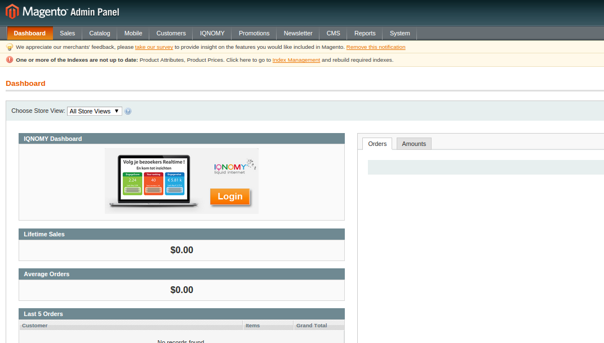
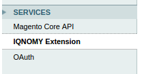
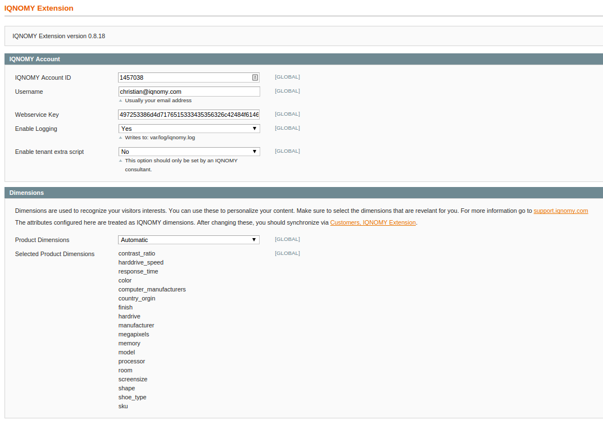
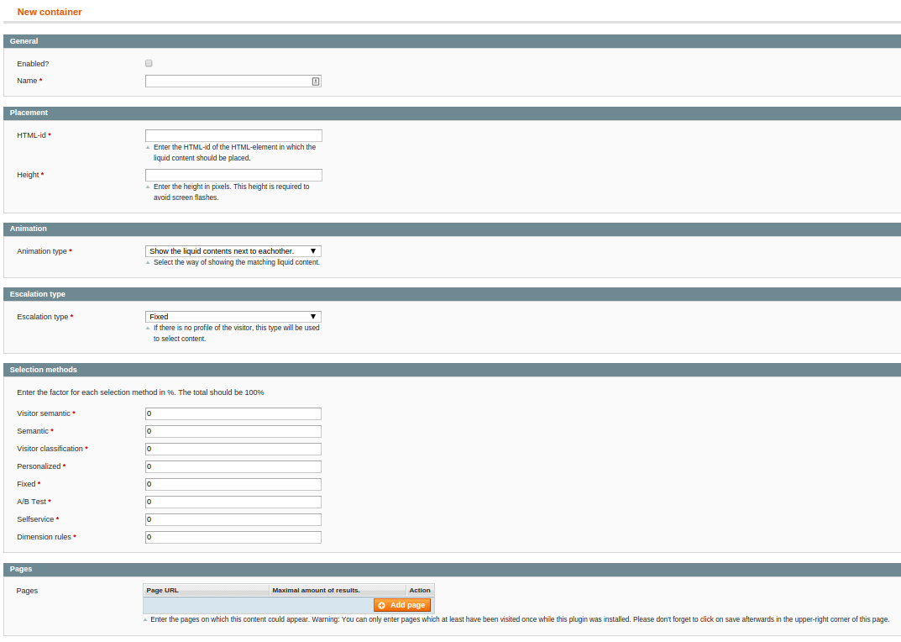

##############
Administrators
##############

.. contents::

************
Introduction
************
You can manage your installed extension from the Magento administration. On the dashboard you will find the IQNOMY logo with a link to your IQNOMY account.

.. _standard_cases:

**************
Standard cases
**************

In the Magento administration the standard cases in IQNOMY can be managed.

* Lead generation
* Selected for you
* Main slider

.. _Configuration:

*************
Configuration
*************
The configuration of the extension can be found through the main navigation *System > Configuration*. If you scroll down you will find the *Services* part in the sidebar.

This will open the extension configuration.

.. _custom:

**********************
Custom liquid internet
**********************
The :ref:`standard cases <standard_cases>` are the main cases, but you can also manage custom liquid internet cases in this extension.

Go in the main menu to *System > IQNOMY*.

And you can add content to a container.

.. _install:

***************
Magento Connect
***************
You can use magento connect to install or upgrade the extension.